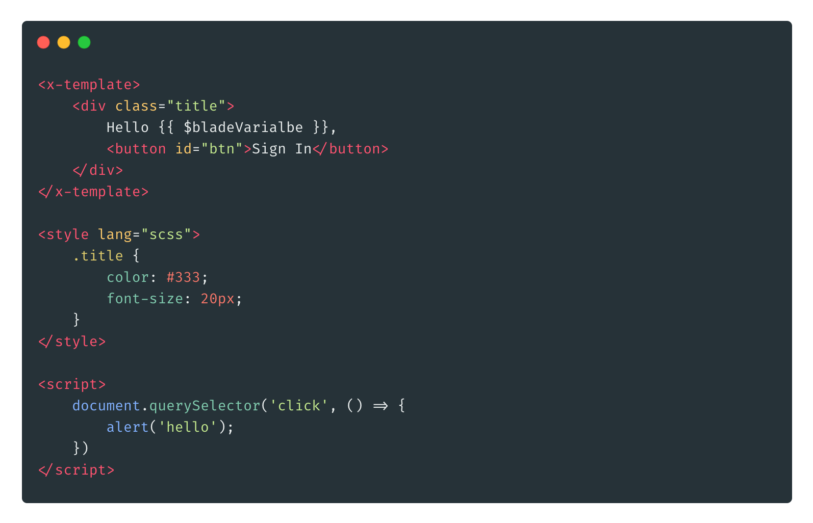

# Single File Blade Component


Laravel Mix extension which lets you use blade components like [Vue's single file components](https://vuejs.org/v2/guide/single-file-components.html).




## Usage
First, install the extension.

```
npm install single-file-blade-component --save-dev
```

Then, require it within your `webpack.mix.js` file:

```js
let mix = require('laravel-mix');

require('single-file-blade-component');


mix.sfbc('resources/views/components/alert.blade.php', 'public/js/alert.js');

// or

mix.singleFileBladeComponent('resources/views/components/alert.blade.php', 'public/js/alert.js');
```

## How it works
This extension extracts JS/CSS from blade file into separate JS/CSS file. During build process, it extracts `style` or `x-style` tag content into a separate css file and `script` or `x-script` tag content into a separate js file. 

[Video demo](https://youtu.be/Fxk96HHA6yU)    

## Examples:

### Minimal example

**alert.blade.php**
```html
<x-template>
    <div class="title">
        Hello {{ $bladeVarialbe }},
        <button id="btn">Sign In</button>
    </div>
</x-template>

<style>
    .title {
        color: #333;
        font-size: 20px;
    }
</style>

<script>
    document.querySelector('click', function(){
        alert('hello');
    })
</script>
```

**webpack.mix.js**
```js
mix.sfbc('resources/views/components/alert.blade.php', 'dist/js/alert.js');
```

> Note: You will have to create `x-template` blade component.

### CSS Pre-Processors
Use `lang' attribute to set css pre-processor

```html
<x-template>
    <div>
        <h1>Hello</h1>
    </div>
</div>
</x-template>

<x-style lang="scss">
    div {
        h1 {
            color: #333;
        }
    }
</x-style>
```

### CSS extraction
By default CSS declared in the blade file will be extracted into a separate file. You can disable this behavior by setting the `extract` attribute value as `false`.

For `extract="false"`, it keeps CSS in the js file and gets injected into the dom via JS.

```html
<x-template>
    <h1>Hello</h1>
</div>
</x-template>

<x-style extract="false">
    h1 {
        color: #333;
    }
</x-style>
```  

## Options
This plugin use [mini-css-extract-plugin](https://github.com/webpack-contrib/mini-css-extract-plugin) for css extraction. You can change mini-css-extract-plugin configuration via `miniCssExtractPlugin` option.

```js
mix.options({
    miniCssExtractPlugin: {
        filename: '[name].css'
    }
})
``` 

## Caveat
Blade renders `script` or `style` tag code on the frontend. To avoid this you can wrap `script` and `style` tag in falsy if statement or create `x-style` and `x-script` blade component. 

```html
@if(false)
    <style>
        h1 {
            color: red;
        }
    </style>
@endif

@if(false)
    <script>
        alert('test');
    </script>
@endif

``` 

